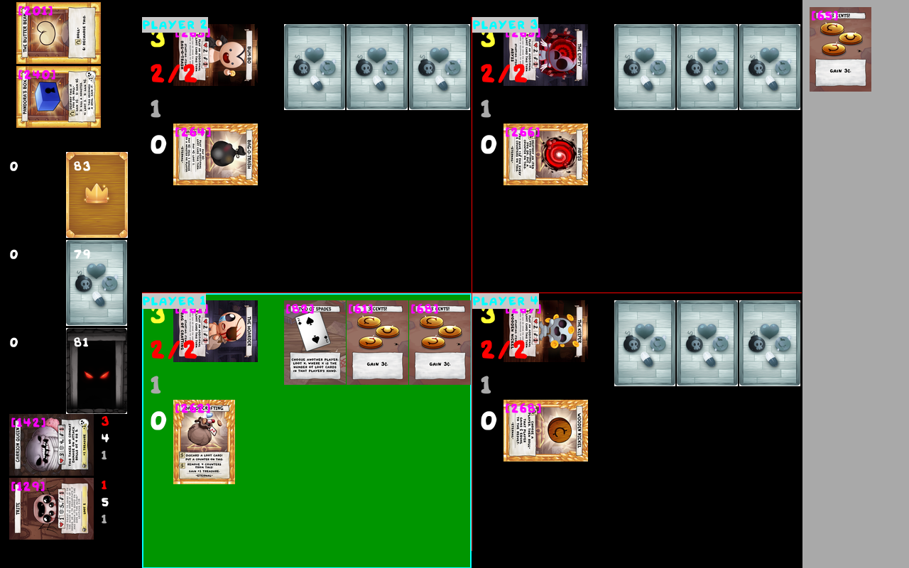
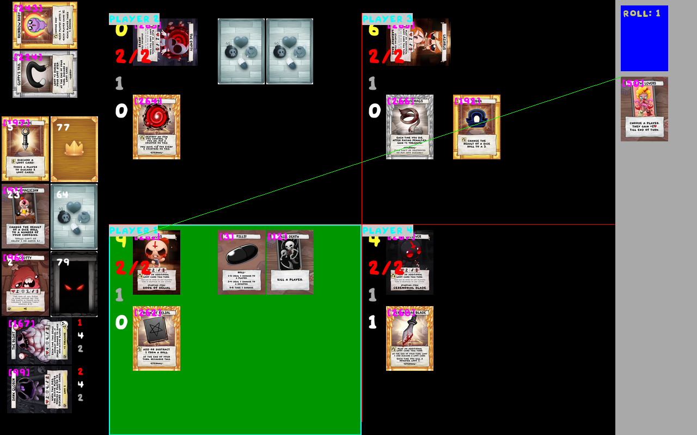
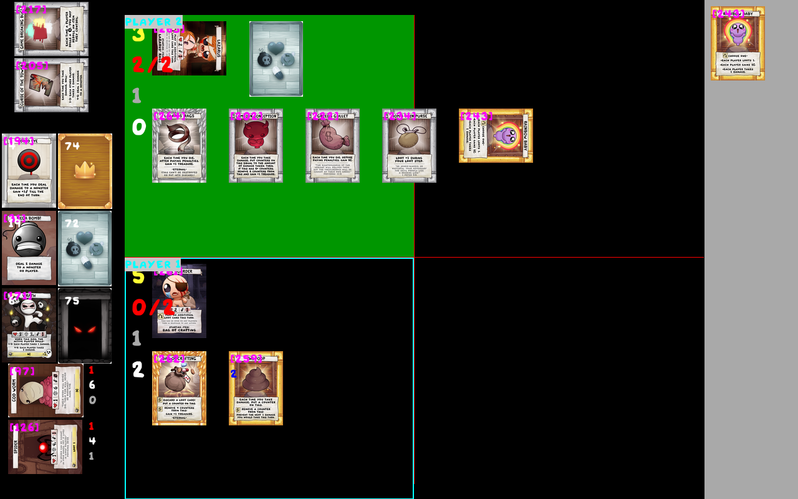

# Four Souls

An application to play the board game four souls online with other people / bots.

## Build

### Unix
```
./configure.sh
./build.sh
```
### Windows
Configure using the CMake gui application, then build using Visual Studio Code.

# Server

!!! The server requires to have a records folder in the same directory to save game records !!!

## Launch a game
To launch a new game: 
```
./four-souls-server [path to game] [number of bots] [number of actual players] [seed(optional)]
```
This will launch a new server. If bots are specified, the program requires to have a random.lua file in the bots directory.

## Replay a game
Every game can be replayed:
```
./four-souls-server [game path] [record path]
```
./build/four-souls-server game 3 1

# Client
To launch a client, you have to have an assets folder with a config.json. In this file will be specified the path to the font you are using, images, etc. The client application works with just a font, but I highly reccomend to download images for a better experience.
Example of a config file:
```
{
    "cards": {
        "Battery Bum": {
            "large": "images/battery_bum_large.bmp",
            "small": "images/battery_bum.bmp"
        },
        "Tick": {
            "large": "images/tick_large.bmp",
            "small": "images/tick.bmp"
        }
        "font": "font.ttf",
        "loot_back": "images/loot_card_back.bmp",
        "monster_back": "images/monster_card_back.bmp",
        "treasure_back": "images/treasure_card_back.bmp"
    }
}
```
To launch a client:
```
./four-souls-client [assets path] [address(optional, default: localhost)]
```
### Controls
Every time a card/player has a green outline, it means that it can be played/interacted. 

To play a card in hand, click it. 

To activate your character card, click it.

To activate an item, click it.

Press space to pass priority / end the turn.

To zoom in on a card, hold shift while mousingg over it.

## Screenshots

<!--  -->

<!--  -->

<!--  -->